[](https://circleci.com/gh/singuerinc/pilot/tree/master) [](https://codecov.io/gh/singuerinc/pilot) [](https://snyk.io/test/github/singuerinc/pilot) [](https://www.codacy.com/app/nahuel.scotti/pilot)

# Pilot

Aggregates information from NPM, Bitbucket among other services and exposes an API to keep an eye on your favourites npm packages.

## API

Currently the are 4 endpoints in the API (Graphql based)



```gql
type Query {
  allBranches: [Branch]
  allCommits: [Commit]
  allReleases(packageName: String!): [Release]
  allReleaseTags(packageName: String!): [Release]
}
```
